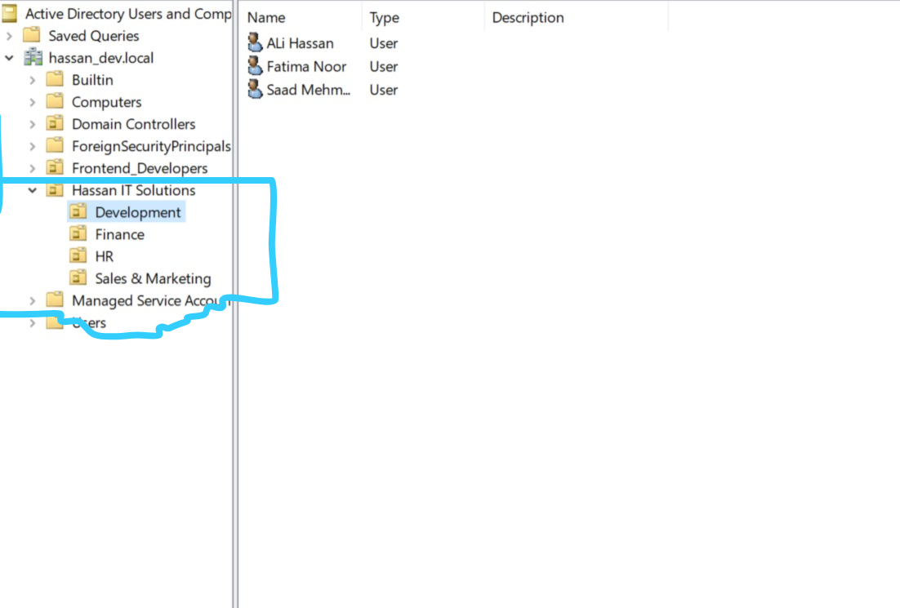
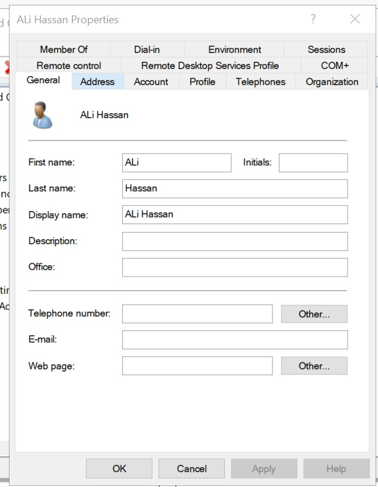

# Phase 3: User Identity & Organizational Structure

## Objective
To design a scalable corporate hierarchy using Organizational Units (OUs) and populate the Active Directory with detailed user identities, replicating a real-world Global Address List (GAL).

## 1. Designing the OU Structure
Instead of dumping all users into the default `Users` container, a logical grouping was created to allow targeted Group Policy applications and administrative delegation.
* Created the following OUs under `hassan_dev.local`:
  * `Development`
  * `HR`
  * `Finance`
  * `Sales`

> 📸 **Screenshot Placeholder:** *(Add an image of Active Directory Users and Computers showing the OU folders)*
> 

## 2. User Provisioning & Identity Enrichment
Standard user accounts were created for each department. To ensure the Active Directory functions as a complete corporate directory, advanced user properties were configured.

**Key Attributes Configured:**
* **General Tab:** First Name, Last Name, Display Name, Telephone Number, and Office Room.
* **Account Tab:** Standardized User Principal Name (UPN) formats (e.g., `firstname.lastname@hassan_dev.local`) and logon hours.
* **Organization Tab (Corporate Hierarchy):** 
  * Assigned specific **Job Titles** (e.g., MERN Stack Developer, HR Director).
  * Established reporting lines by assigning a **Manager** to junior employees. This is crucial for dynamic reporting and automated workflows.

> 📸 **Screenshot Placeholder:** *(Add an image showing a User's Properties, specifically the Organization tab with the Manager field filled)*
> 

## 3. Verification
Verified that the organizational hierarchy is accurately reflected by searching for users within the directory and confirming their reporting lines and departmental associations.
