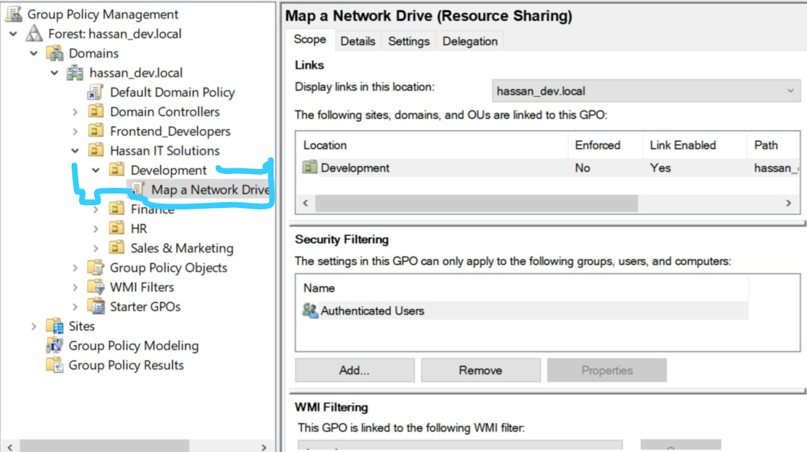
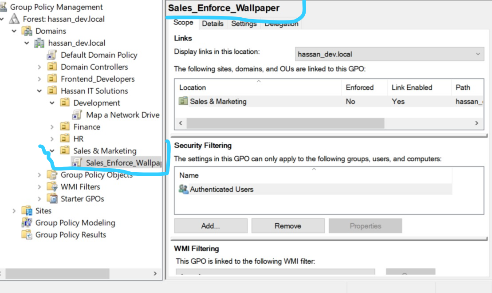
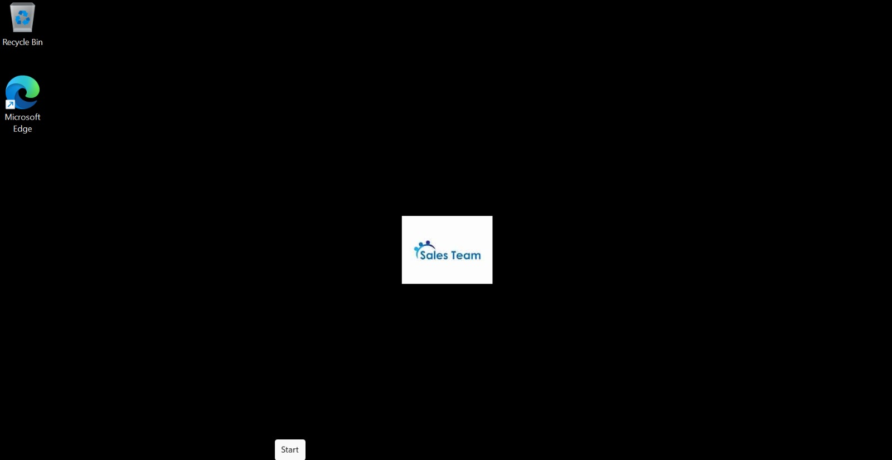

# Phase 4: Group Policy Management (GPO)

## Objective
To automate user configurations, enforce security standards, and provision resources dynamically across different departments using Group Policy Objects.

## 1. Centralized File Services
Before applying policies, a central repository was required.
* Created a directory named `Company_Shared` on the AD Server.
* Configured Advanced Sharing and assigned specific NTFS permissions to ensure only authorized users could read or write data.

## 2. Automated Drive Mapping (Development OU)
Instead of manually mapping drives on every developer's machine, a GPO was deployed to automate this process.
* **Policy Type:** User Configuration > Preferences > Windows Settings > Drive Maps.
* **Target:** Linked specifically to the `Development` OU.
* **Action:** Automatically maps the `\\AD-Server\Company_Shared` path to the `Z:` drive upon user logon. This allows the engineering team to easily collaborate on database schemas, architecture diagrams, and shared assets for their MERN stack projects without relying on local storage.

> 📸 **Screenshot Placeholder:** *(Add an image of the Group Policy Management Console showing the Drive Map GPO linked to the Development OU)*
> 

## 3. Desktop Standardization (Sales OU)
To maintain corporate branding, a policy was enforced to standardize the desktop environment for the Sales department.
* **Policy Type:** User Configuration > Policies > Administrative Templates > Desktop > Desktop.
* **Target:** Linked specifically to the `Sales` OU.
* **Action:** Enabled "Desktop Wallpaper" and pointed it to a corporate background image hosted on the network share. Enabled "Prevent changing desktop background" to restrict user modifications.

> 📸 **Screenshot Placeholder:** *(Add an image of the Sales Wallpaper Policy settings)*
> 

## 4. Client-Side Verification
To validate the infrastructure:
1. Logged into `Client-PC1` using a Development user account (e.g., Ali Khan).
2. Ran `gpupdate /force` in the Command Prompt to pull the latest policies from the Domain Controller.
3. Verified that the `Z:` drive appeared automatically in "This PC".
4. Logged out and logged back in as a Sales user to verify the desktop wallpaper was applied and locked.

> 📸 **Screenshot Placeholder:** *(Add an image of the Client PC showing the successfully mapped Z: drive)*
> 
