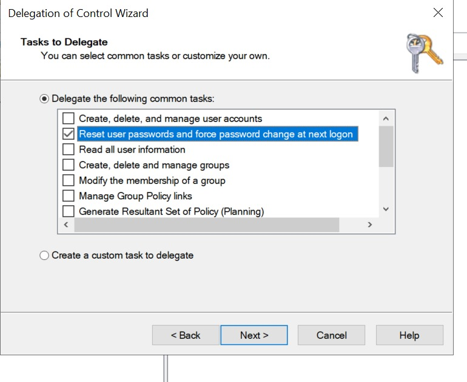

# Phase 5: Delegation of Control & Role-Based Access (RBAC)

## Objective
To implement the principle of least privilege by delegating specific administrative tasks (like resetting passwords) to non-admin users, reducing the workload on the core IT department.

## 1. The Real-World Scenario
In a corporate environment, the HR department or a Tier-1 Helpdesk often needs to reset employee passwords or unlock accounts. However, giving them full "Domain Admin" rights is a massive security risk. We solve this using the **Delegation of Control Wizard**.

## 2. Implementation Steps
We delegated password reset authorities to the HR Manager (e.g., Zainab Tariq) specifically for the `Sales` OU.

1. Opened **Active Directory Users and Computers (ADUC)**.
2. Right-clicked the target Organizational Unit (`Sales`) and selected **Delegate Control**.
3. In the wizard, added the specific user or group (e.g., `Zainab Tariq` from HR).
4. **Tasks to Delegate:** Selected the pre-configured option: *"Reset user passwords and force password change at next logon"*.
5. Completed the wizard to apply the granular permissions.

> 📸 **Screenshot Placeholder:** *(Add an image of the Delegation of Control Wizard showing the selected tasks)*
> 

## 3. Verification & Security Check
To verify the implementation:
* Logged into a client machine using the HR Manager's standard credentials.
* Installed/Opened the RSAT (Remote Server Administration Tools) ADUC console.
* Confirmed that the HR Manager can successfully right-click and reset passwords for users inside the `Sales` OU, but receives an **"Access Denied"** error if they attempt to delete a user, modify group policies, or reset passwords in other OUs like `Development` or `Finance`.
