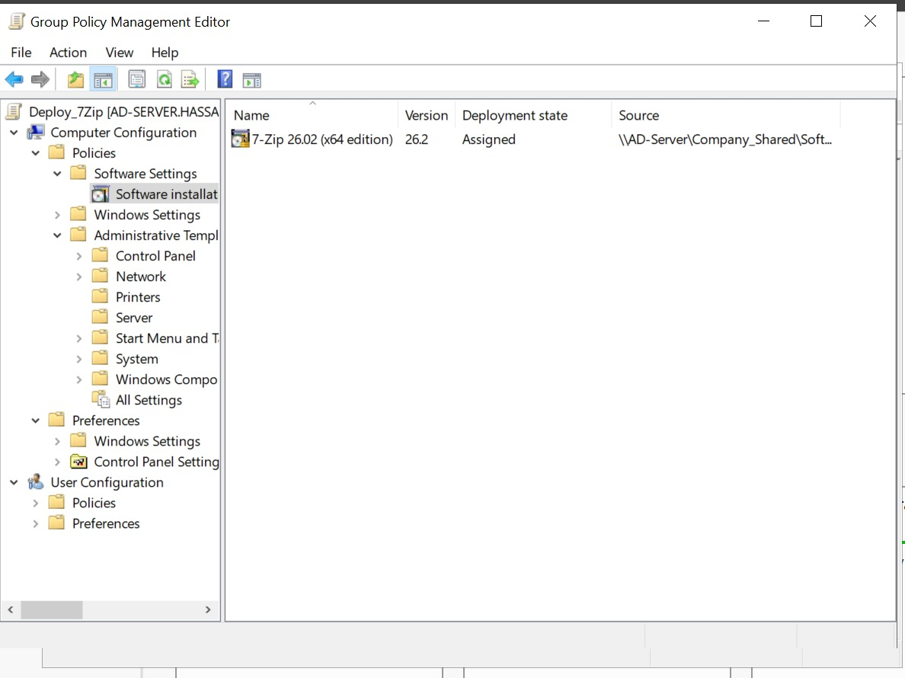

# Phase 6: Automated Software Deployment (GPO)

## Objective
To automate the installation of essential software tools across specific departments, eliminating the need for manual installations and ensuring all users have standardized software versions.

## 1. The Scenario
The `Development` team frequently requires tools like text editors (e.g., Notepad++). Instead of the IT team manually installing this on every developer's machine, we use Group Policy Software Installation.

## 2. Setting Up the Deployment Share
Group Policy requires a central, accessible network location containing the software installer file. Crucially, the installer *must* be in `.msi` (Microsoft Installer) format, not `.exe`.
1. Downloaded a sample `.msi` installer (e.g., Notepad++ MSI).
2. Placed the `.msi` file inside the shared directory: `\\AD-Server\Company_Shared\Software`
3. Ensured the "Domain Computers" group had Read access to this shared folder, as the computer itself performs the installation during boot, before a user logs in.

## 3. Creating the Deployment GPO
1. Opened **Group Policy Management** (`gpmc.msc`).
2. Created a new GPO named `Deploy_Notepad++` and linked it to the `Development` OU.
3. Edited the GPO and navigated to: **Computer Configuration > Policies > Software Settings > Software installation**.
4. Right-clicked > **New > Package**.
5. *Critical Step:* Selected the `.msi` file using the **Network Path** (`\\AD-Server\Company_Shared\Software\installer.msi`), not the local `C:\` drive path.
6. Selected the **Assigned** deployment method. This forces the software to install automatically.

> 📸 **Screenshot Placeholder:** *(Add an image showing the GPMC with the Software Installation package configured)*
> 

## 4. Verification
1. Logged into `Client-PC1` using a user account from the `Development` OU.
2. The installation occurs transparently during the Windows boot process. Upon logging in, Notepad++ was available in the Start Menu, verifying the automated deployment was successful.
