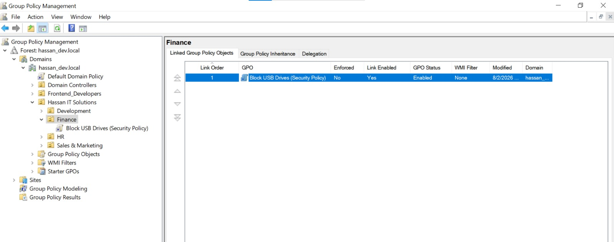
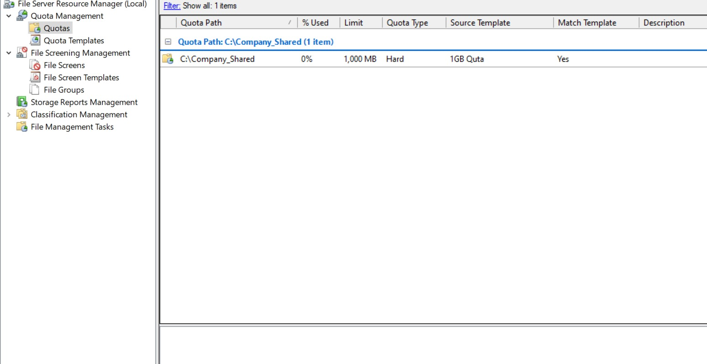

# Phase 7: Advanced Security Policies (Data Protection & FSRM)

## Objective
To implement robust data protection mechanisms by controlling removable storage access and managing network file server capacities to prevent data exfiltration and storage exhaustion.

## 1. Restricting Removable Storage (Finance OU)
The Finance department handles sensitive corporate data. To prevent data leaks, a Group Policy was implemented to deny write access to removable drives (USB flash drives).

* **Policy Type:** User Configuration > Policies > Administrative Templates > System > Removable Storage Access.
* **Target:** Linked specifically to the `Finance` OU.
* **Action:** Enabled the policy **"Removable Disks: Deny write access"**. Users can still read from USB drives if needed, but cannot copy corporate data onto them.

> 📸 **Screenshot Placeholder:** *(Add an image of the GPO settings showing Removable Storage Access configured)*
> 

## 2. File Server Resource Manager (FSRM)
To prevent the central `Company_Shared` folder from being overwhelmed by unnecessary or massive files, the FSRM server role was installed and configured.

### A. Quota Management
* Applied a **1 GB Hard Quota** on the `\\AD-Server\Company_Shared\Development` folder. 
* If users attempt to exceed this limit, the server actively blocks the transfer and generates an event log.

### B. File Screening
* **Scenario:** Employees saving personal media files on corporate servers wastes expensive storage.
* **Action:** Created a File Screen on the shared directory blocking the **"Audio and Video"** file group (e.g., `.mp3`, `.mp4`, `.avi`). 
* Attempting to copy these file types results in an immediate "Access Denied" prompt from the server.

> 📸 **Screenshot Placeholder:** *(Add an image of the FSRM console showing the configured Quota and File Screen)*
> 

## 3. Verification
1. Logged into a `Finance` user account and attempted to copy a text file to a connected USB drive. The action was blocked by Windows security.
2. Logged into a `Development` account and attempted to copy an `.mp4` video file to the mapped `Z:` drive. The server successfully rejected the file transfer.
